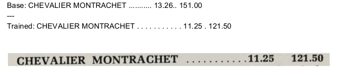

# UC Davis DSI DataFest 2018

##### Table of Contents 
* [Introduction](#introduction)
  * [Background](#background)
  * [Team](#team)
* [Why Fine-Tune Tesseract?](#why-fine-tune-tesseract)
* [Using this Package](#using-this-package)
  * [Prerequisites](#prerequisites)
  * [Running the Demo](#running-the-demo)


## Introduction
#### Background
DSI DataFest 2018 was held September 18-21, 2018 at the [UC Davis Data Science Initiative](http://dsi.ucdavis.edu/). 


**The challenge**: To find/test ways to correctly extract wine and spirit price information from scanned [Sherry Lehmann](https://www.sherry-lehmann.com/about-sherry-lehmann-wine-and-spirits) catalogs and turn the extracted information into usable 
structured data that can be utilized by interested parties such as researchers and wine historians. 

The UC Davis Library has over 200 scanned Sherry Lehmann catalogs spanning multiple years: 1938, 1941, and 1947 to 1988. This 
library collection totals to over 4000 pages, and is part of an ongoing Data Science project at the [UC Davis Libray](https://www.library.ucdavis.edu/).

The layout, fonts and coloring of the catalog pages varies, sometime widely, between catalogs and even within catalogs. 
[Some examples can be see here](https://github.com/sitaber/UC-Davis-DSI-DataFest-2018/wiki/Example-Images).

This introduces an extra layer to the challenge, since a solution that works for a sub-set of pages that are similar 
will not be readily applicable to the whole corpus of catalog images.


#### Team
**ZeroInfinity** 
* Mira Daya: <mmdaya@ucdavis.edu>
* Stanislaw Saganowski: <stanislaw.saganowski@pwr.edu.pl>
* Scott Taber: <sitaber@ucdavis.edu> | <https://github.com/sitaber/UC-Davis-DSI-DataFest-2018>
* Kevin Benelli:  <kbenelli@ucdavis.edu> | <https://github.com/Kevin-Benelli/wine-recognition-ocr>

**Team Approach**:
The team attacked this problem from three angles. 
1. Trying methods of image preprocessing using python
2. Improving character recognition of [Tesseract](https://github.com/tesseract-ocr/tesseract) via fine tuning
3. Parsing the resulting extracted text file to retrieve targeted information

**This Repository**

A self-contained package that demonstrates the teams fine-tuning of Tesseract.

## Why Fine-Tune Tesseract?
A conceptual approach to extracting data from the images is as follows

```
data collection => preprocessing => character recognition => formatting into structured data
```

The data collection was already done for this challenge, so the problem reduces to

```
 preprocessing => character recognition => formatting into structured data
```

Preprocessing can greatly enhance Tesseract’s ability to recognize text from the images, but due to the variety of fonts and layouts of the catalogs, the "out of the box" languages for Tesseract fail to identify some characters and many digits accurately. This inhibits the ability to create structured data and is why fine-tuning was an angle of attack chosen.

### Some Results

To illustrate to effectiveness of training Tesseract to recognize the text in the catalogs, [here are some results of training Tesseract on a small set of training data.](https://github.com/sitaber/UC-Davis-DSI-DataFest-2018/wiki/Results)



The training was done with a small set of 10 images. The results are promising for such a small training set. The recognition of the digits is improved and the sequences of ``` ...``` also have improved recognition.


## Using this Package

The fine-tuning was done on a computer running Xubuntu 18.04 LTS, and the procedure outlined is only valid for this operating-system. It can work on others, but is only guaranteed for Xubuntu 18.04 LTS.

#### Prerequisites

1. A computer or virtual machine running Xubuntu 18.04 LTS. An image for this OS can be found at https://xubuntu.org/download

2. The [Tesseract Open Source OCR Engine](https://github.com/tesseract-ocr/tesseract) version 4.0.
This can be installed by running
```
sudo apt install tesseract-ocr
sudo apt install libtesseract-dev
```
For further details please see the [Tesseract wiki](https://github.com/tesseract-ocr/tesseract/wiki)

3. Additional Libraries. 
```
sudo apt-get install libicu-dev
sudo apt-get install libpango1.0-dev
sudo apt-get install libcairo2-dev
```
4. The python library pillow to use `generate_line_box.py`
```
pip install Pillow
```
5. langdata-master from (https://github.com/tesseract-ocr/langdata)

#### Running the Demo

This demo utilizes elements of [ocrd-train](https://github.com/OCR-D/ocrd-train). `Makefile` was modified to suit the needs of fine-tuning Tesseract, and the primary part of ocrd-train used was the python script `generate_line_box.py`, which is called from MakeFile. This python script creates the necessary `.box` files from `.tif` and `.gt.txt` which are located in data/train.


To use this demo, download this repositoy with this link https://github.com/sitaber/UC-Davis-DSI-DataFest-2018/archive/master.zip.


This demo is self contained, and Makefile should be run from the directory in which it is contained.

First, unzip `langadata-master.zip` that was downloaded in part `5.` of Prerequisites to `ocrd-train-mod`

Open Terminal and navigate to the `ocrd-train-mod` directory

Execute the following command
```
make training MODEL_NAME=test CONTINUE_FROM=eng_best
```
NOTE: you may use any name after `MODEL_NAME=` 

The fine-tuning process should now be running. You should see something similar to the image below
*insert training image*

The number of iterations is set to 300. Simply let the process complete, and copy the resulting model_name.traineddata to the tessdata folder where tesseract-ocr files are located. For example `/usr/share/tesseract-ocr/4.00/tessdata/`. 

This location may vary depending on your system and how you installed Tesseract. If following this guide, and using Xubuntu installed form scratch, this will be the correct directory.

To use the newly trained model, execute the following in the directory that contains it to copy it to the main tessdata where Tesseract looks for languages to use
```
sudo cp model_name.trianeddata /usr/share/tesseract-ocr/4.00/tessdata/
```
where `model_name` is the name used when invoking `make`

With the new trained/finetuned `.traineddata` in the `tessdata` directory, run
```
tessearct test.img test_out -l model_name
```
To generate text with the new trained model. Where again, `model_name` is the name used when invoking `make`


